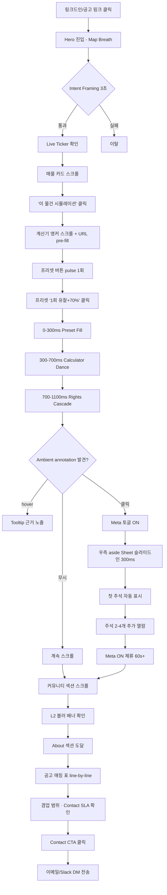
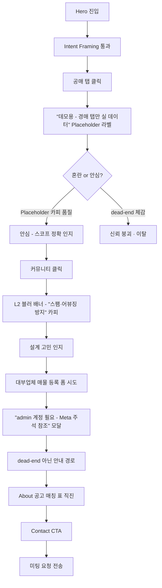
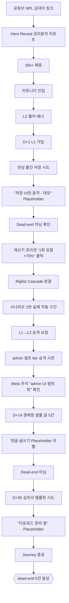

# UX Design Specification — NPL 마켓

**Author:** blynn
**Date:** 2026-04-21

---

## Executive Summary

### Project Vision

NPL 마켓은 한 URL에 두 모드를 공존시키는 이중 레이어 플랫폼이다. **Meta 토글 OFF**는 NPL 정보 매칭 허브(매물 탐색 3탭 · 배당 채권계산기 · L2+ 현직자 커뮤니티)로 작동하는 SaaS 사용자 체험층이고, **Meta 토글 ON**은 각 기능에 "왜 이 선택?" 주석 11개를 aside 슬라이드인으로 펼치는 포트폴리오 심사층이다. 이 이중 구조가 "프로덕트 완성도"와 "설계 의도"를 동시에 증명함으로써 외주 발주자의 수주 결정을 견인한다.

UX의 중심 질문은 세 가지로 수렴한다:
- 발주자가 Hero부터 Contact까지 끊기지 않고 스크롤 완주할 수 있는가?
- 계산기에서 "ERP 수준 시스템"을 체감할 수 있는가?
- Meta 토글이 열리거나 / Placeholder 라벨로 정직 노출되는가?

### Target Users

**Primary — 외주 발주자 2명 (심사 목적, 실사용 아님)**

- **B. 프롭테크 대표 (김대표, 42세, 대구 시리즈A, 1순위)** — 데스크톱 중심, 3-5 탭 비교 심사 모드. Intent Framing 3초 → 계산기 2분 → Meta 토글 5분 → About 공고 매칭 표 → Contact CTA 경로를 따름.
- **A. 법무법인 파트너 (박변호사, 48세, 2순위)** — 모바일 첫 진입(링크드인 피드) 후 저녁 데스크톱 재방문 패턴. 권리분석 리포트의 법률 정확도가 인증 포인트.

**Secondary — 김OO (35세, NPL 초보)**

- 실사용 완결 아닌 **"dead-end 0건"** 기준. Primary가 김OO Journey를 관찰할 때 신뢰가 유지되는 수준이 설계 목표. Placeholder 라벨 체계가 신뢰 방어선.

**Operator — blynn (admin)**

- 하드코딩 admin 계정 + Supabase 직접 쿼리로 최소 운영. Admin UI는 MVP 범위 밖(스코프 선별 역량 시그널).

### Key Design Challenges

1. **Meta 토글 이중 레이어의 UI 일관성** — 토글 ON/OFF에서 레이아웃 리플로우 없이 자연스러운 전환. Ambient annotation (`·` / "왜?" 인디케이터)의 **은은함 vs discoverability** 트레이드오프 (현실 discovery rate 15~25% 반영, 토글 ON 첫 주석 자동 슬라이드인으로 보조).
2. **계산기의 복잡도-친밀성 동시 성립** — 입력 15필드 · 출력 25+를 Conversational Chunking으로 분할하되 프리셋 원클릭이 전체 동선을 장악. 모바일에선 첫 스텝 품질만 보장(Journey 3 경계).
3. **Placeholder 라벨 체계 = 신뢰 신호** — 미구현을 숨기지 않고 `<PlaceholderLabel reason=... />` 표준 컴포넌트로 노출. "dead-end가 아닌 설계 의도"로 보이게 하는 카피·비주얼 일관성 확보.
4. **규제 인식을 UI 단어에 담기** — "거래" → "정보 매칭", "가입 승인" → "대부업법 L2 적격성 자진 확인" 리프레이밍이 곧 세일즈 시그널. 카피 한 줄·체크박스 하나의 단어 선택이 설계 역량 증명.
5. **OFF 경로 단독 설득력** — Meta 토글을 끝까지 안 켜는 발주자(Journey 2)에게도 Primary Success 성립해야 함. Intent Framing 스트립 + Placeholder 라벨 + 공고 매칭 표가 OFF 경로의 주역.

### Design Opportunities

1. **Meta 토글 — 독창적 UX 장치** — 한 URL 이중성은 다른 포트폴리오에 없는 차별화. 첫 주석 자동 슬라이드인이 discovery 보조 + 스코프 선별 사고를 가시화.
2. **Calculator Dance + Rights Cascade 애니메이션** — 30초 Hero Reveal 구간에서 "업무 이해도"를 즉각 전달. B2C 친밀성의 표면 아래 B2B 복잡도를 드러내는 단일 장면.
3. **공고 매칭 표** — About 섹션이 발주 공고와 line-by-line 대응. 일반 풀스택 포트폴리오 대비 맞춤 시그널의 핵심 장치.
4. **실 사건번호 + 정적 스냅샷** — "2024타경110044" 같은 실 데이터 노출로 "진짜 데이터" 신호 + courtauction.go.kr 약관 방어 양립.
5. **L2+ 게이팅 블러 배너** — 현직자 커뮤니티 희소성을 시각화하면서 동시에 "스팸·어뷰징 방지 1차 방어선" 설계 사고 증명.

---

## Core User Experience

### Defining Experience

Core Experience는 단 하나의 2-5분 구간이다 — **발주자가 Hero Map Breath를 보고 호기심을 가진 직후, 계산기 프리셋 "1회 유찰+70%"를 원클릭하여 Rights Cascade가 재정렬되고 Calculator Dance가 25+ 출력 필드를 아름답게 펼쳐 보이는 순간**. 이 한 번의 상호작용이 전체 포트폴리오의 Proof of Work이며, 입력 15필드의 복잡도가 0필드처럼 느껴지면서 동시에 ERP 수준 의사결정 지원 시스템임을 체감하게 만드는 단일 장면이다. 이 모먼트가 실패하면 Meta 토글도 공고 매칭 표도 모두 무력해진다.

**Core Loop (발주자 심사 동선)**: Intent Framing 3초 → 계산기 프리셋 체험 2-5분 → Meta 토글 1회 ON + 첫 주석 슬라이드인 → About 공고 매칭 표 line-by-line 확인 → Contact CTA.

### Platform Strategy

- **Web 단일 URL** — 설치·앱 스토어 마찰 제로. 링크드인·슬랙 공유 1클릭.
- **데스크톱 1440px 기준 설계** (발주자 B 주요 진입), **1024px 랩탑 기본 대응**.
- **모바일 내성 최소 기준** — 첫 스텝 · Hero Reveal · Contact mailto만 보장 (Journey 3 박변호사 진입 패턴 대응).
- **입력 방식**: 마우스/키보드 기본, 터치 호환 정도. **키보드 Tab 완결성 MUST** (계산기 15필드 순서, Meta 토글 스페이스바, aside focus trap).
- **오프라인·네이티브 앱 미지원** — 모두 Vision 또는 Placeholder.

### Effortless Interactions

| 상호작용 | 설계 의도 |
|---|---|
| **계산기 프리셋 원클릭** | 입력 15필드를 0필드처럼 — "1회 유찰+70%" 한 버튼이 전체 입력 자동 채움 |
| **Meta 토글 ON/OFF 전환** | 우상단 토글 또는 스페이스바, 레이아웃 리플로우 없음 |
| **Placeholder 라벨** | 클릭 시 즉각 "이건 의도된 미구현" 맥락 제공, dead-end 발생 없음 |
| **Hero → 계산기 자연 스크롤** | 내비게이션 메뉴 없이 세로 흐름이 동선 유도 |
| **모바일 Contact mailto** | 클릭 즉시 메일 앱 자동 실행, 수신자 자동 입력 |
| **첫 Meta 주석 자동 슬라이드인** | 토글 ON 순간 사용자 액션 없이 첫 주석 노출 — discovery 보조 |

### Critical Success Moments

| 모먼트 | 트리거 순간 | 실패 시 영향 |
|---|---|---|
| **Intent Framing 3초** | Hero 스트립 노출 | "서비스/포트폴리오" 인지 혼란 → 즉시 이탈 |
| **계산기 원클릭 재정렬** | 프리셋 클릭 후 Rights Cascade 애니메이션 | "업무 이해도" 신호 실패 → 일반 풀스택으로 격하 |
| **Meta 첫 주석 자동 슬라이드인** | 토글 ON 전환 직후 | "숨은 의도 발견" 실패 → 차별화 약화 |
| **Placeholder 라벨 첫 발견** | 미구현 영역 클릭 | dead-end 인식 → 신뢰 즉사 |
| **About 공고 매칭 표 도달** | 스크롤 종착점 | "내 공고 구조적 이해자" 확신 실패 → Contact CTA 무력화 |
| **계산기 샘플 5건 원 단위 정합성** | 발주자 검증 시점 | 도메인 권위 붕괴, 복구 불가 |

### Experience Principles

1. **주연은 발주자 하나** — 모든 UX 결정은 Primary가 관찰·심사할 때 신뢰 유지 기준으로 판단. Secondary(김OO) 실사용 완결은 2순위.
2. **복잡도를 원클릭 아래 숨기되, Meta 주석으로 드러낸다** — 표면은 친밀·원클릭, Meta ON에선 "왜 이 선택?"이 ERP급 복잡도 노출. 두 면이 한 UI로 공존.
3. **정직이 차별화다** — Placeholder 라벨 · 겸업 범위 명시 · "데모용" 노출이 일반 포트폴리오 대비 숨은 킬러 축.
4. **규제 인식은 UI 단어에 담긴다** — "거래" → "정보 매칭" 같은 카피 리프레이밍이 설계 역량 증명. 배너·체크박스 문구가 세일즈 시그널.
5. **OFF 경로가 Plus 옵션 없이 성립해야 한다** — Meta 토글 미열람 발주자에게도 Intent Framing + Placeholder + 공고 매칭 표만으로 Primary Success 가능.
6. **애니메이션은 복잡도 서사의 일부다** — Calculator Dance · Rights Cascade는 장식 아닌 의사결정 과정 가시화. Performance ≥ 80 범위 내에서만.

---

## Desired Emotional Response

### Primary Emotional Goals

NPL 마켓의 감정 디자인은 **두 청중 분리 설계**가 핵심이다.

**발주자 (Primary) — 핵심 감정 = "Recognition (인정·발견)"**
- "이 사람은 다른 지원자랑 다르다" — 흥분·감탄이 아닌 조용하지만 확고한 인지 전환.
- 보조 감정: **신뢰 (Trust)** · **존중 (Respect)** · **안도 (Relief)**.
- 신뢰는 정직한 Placeholder·규제 인식 카피에서, 존중은 About 공고 매칭 표에서, 안도는 "다른 후보 더 안 봐도 되겠다" 판단에서 발생.

**김OO (Secondary) — 핵심 감정 = "Confidence + Belonging-in-waiting (자신감 + 소속 예감)"**
- 계산기 친밀성에서 "어려운 NPL을 이해할 수 있겠다" 자신감.
- L2 블러 배너에서 "검증 받으면 진짜 현직자 동네 입성" 기대.
- 단, Primary가 관찰할 때 자연스러운 수준이면 충분.

### Emotional Journey Mapping

**Journey 1 (발주자 B, Success Path) — 6단계 감정 곡선**

| 시점 | 감정 | 트리거 |
|---|---|---|
| 0~3초 | **호기심 + 긴장 해제** | Hero Map Breath 부드러운 맥박 + Intent Framing 스트립 |
| 30초~2분 | **놀람 → 즉각 신뢰** | 실 사건번호 + 계산기 프리셋 원클릭 재정렬 |
| 2~5분 | **발견의 즐거움** | Meta 토글 ON + 첫 주석 자동 슬라이드인 |
| 5~8분 | **인정 (Recognition)** | 주석 3-4개 열람 — 법·규제 사고까지 인지 |
| Climax | **확신** | About 공고 매칭 표 line-by-line 일치 |
| Resolution | **안도 + 결단** | Contact CTA 클릭 |

**Journey 2 (발주자 B, Meta OFF) — Plus 옵션 없이 성립**

| 지점 | 감정 | 트리거 |
|---|---|---|
| Placeholder 첫 발견 | **혼란 → 안심** | "데모용" 라벨이 스코프 선별 감각 증명 |
| About 매칭 표 | **확신 (Meta 없이도)** | 공고 line-by-line — OFF 경로 단독 Recognition |

**김OO (Secondary) 여정**
- D+0: **호기심 + 무료 이득** (Hero Reveal 권리분석 무료 공개)
- D+7: **자신감** (계산기 프리셋 완결)
- D+14~30: **소속 예감** (커뮤니티 블러 배너 → L2 가입 동기)

### Micro-Emotions

**회피해야 할 부정 감정과 차단 장치**

| 회피 감정 | 발생 지점 | 차단 장치 |
|---|---|---|
| **혼란** | "서비스/포트폴리오" 인지 실패 | Intent Framing 스트립 (3초 내) |
| **불신** | "이거 진짜 작동하나?" | 실 사건번호 + 계산기 원 단위 정합성 |
| **답답함** | dead-end 클릭 | Placeholder 라벨 표준 컴포넌트 |
| **압도감** | 계산기 15필드 첫 노출 | Conversational Chunking + 프리셋 원클릭 |
| **불안** | 법적 회색지대 인지 | 카피 리프레이밍 + 법적 고지 배너 |
| **소외** | L2 미검증 커뮤니티 차단 | 블러 배너 카피에 설계 의도 노출 |

**역활용할 약한 부정 감정**
- L2 게이팅 블러 배너의 약한 부러움·조급함 → "들어가고 싶다" 동기. 단 발주자 관점에선 "체계적 설계" 신호로 보임.

### Design Implications

| 감정 | UX 결정 |
|---|---|
| Recognition | About 공고 매칭 표 line-by-line 정렬, 공고 단어 그대로 헤더 인용 |
| 신뢰 | Placeholder 라벨 일관성, 겸업 범위 명시, 보안 Meta 주석 |
| 존중 | 공고 매칭 표 + 겸업 범위 + Contact 응답 SLA 노출 |
| 발견의 즐거움 | Ambient annotation `·` / "왜?" 인디케이터, 토글 ON 첫 주석 자동 슬라이드인 |
| 자신감 (Secondary) | 계산기 프리셋 원클릭, 용어 호버 툴팁, Conversational Chunking |
| 안심 (Placeholder) | 일관된 라벨 컴포넌트, "이유" 카피 노출 |
| 압도감 차단 | 15필드를 4-5 step 청킹, 한 화면에 1 step만 노출 |
| 소속 예감 (Secondary) | L2 블러 배너의 "현직자 전용" 카피 + 샘플 글 5건 미리보기 |

### Emotional Design Principles

1. **감정의 1순위 청중은 발주자다** — Secondary 감정 설계는 Primary가 관찰할 때 자연스러우면 충분.
2. **흥분이 아닌 인정을 추구한다** — 화려한 감탄이 아닌 조용한 Recognition. 과장된 애니메이션·팝업 회피.
3. **부정 감정은 회피하지 말고 재해석한다** — Placeholder의 dead-end 위험을 "설계 의도"로, 차단을 "설계 사고"로 전환.
4. **Meta 토글 = 발견의 즐거움 단일 장치** — 발견 감정은 Meta 토글에 집중, 다른 인터랙션은 안정·신뢰에 집중.
5. **공고 매칭 표는 감정 Climax** — 모든 감정 곡선이 이 한 섹션의 Recognition 모먼트로 수렴되도록 동선 설계.

---

## UX Pattern Analysis & Inspiration

### Inspiring Products Analysis

발주자(Primary)가 이미 신뢰하는 제품의 UX 언어를 역공학해 NPL 마켓 UX 결정의 정당화 앵커로 사용한다.

1. **빌사남** — 부동산 데이터를 절제된 카드 그리드 + 숫자 중심 타이포로 노출. "전문가 느낌" 과장 없이 전달. → 매물 카드·금액 표기·특수물건 태그.
2. **상위 오픈소스 GitHub README** — Why > How > What 선별 구조, 겸손한 톤. → About 톤·공고 매칭 표 구조·의사결정 로그.
3. **Linear** — 키보드 중심 인터랙션, 정보 밀도 속 화이트스페이스. "프로덕트 만드는 팀" 감각. → Meta 토글 단축키, Tab 완결성, 절제된 모션.
4. **Stripe Docs / Supabase Dashboard** — Two-column "설명 ↔ 사이드 주석" 레이아웃. → **Meta 토글 aside 슬라이드인의 직접적 원형**.
5. **Apple 제품 페이지 / Arc Browser 랜딩** — 세로 스크롤 내러티브 + 한 섹션 한 메시지. → Hero → 계산기 → Meta → About → Contact 단일 URL 구조.
6. **Notion** — 슬래시 명령 원클릭. 초보와 파워 유저 공존. → 계산기 프리셋 = NPL 슬래시 명령.
7. **월급쟁이부자들** — 가치 사다리·L2 검증으로 커뮤니티 품질 방어선. → 3-tier RBAC + L2 게이팅 블러 배너 설계 근거.
8. **Figma** — 전문가 기능 밀도 속 친밀한 커서·코멘트. "어려운데 재밌다" 감각. → Calculator Dance가 복잡도에 부여하는 친밀성.

### Transferable UX Patterns

**Navigation Patterns**
- **세로 스크롤 내러티브** (Apple · Arc · Stripe 랜딩) — 내비 메뉴 없이 섹션 스크롤만으로 동선. 5-8분 심사 집중도 유지.
- **앵커 링크** (`/#calculator`, `/#about`) — 링크드인 DM에서 특정 섹션 바로 공유.

**Interaction Patterns**
- **Sidebar Annotation** (Stripe Docs · Supabase) — Meta 토글 aside 슬라이드인의 원형.
- **Preset/Template 원클릭** (Notion · Figma) — 계산기 프리셋 3종 메타포.
- **Keyboard Shortcut** (Linear · Superhuman) — 스페이스바 Meta 토글, "프로덕트 팀 문화" 신호.
- **Conversational Chunking** (Typeform · Stripe Checkout) — 15필드 한 스텝씩, 압도감 차단.
- **Progressive Disclosure** (Figma 인스펙터 · Linear 세팅) — Ambient annotation `·`/"왜?" 인디케이터로 주석 존재 암시.

**Visual Patterns**
- **숫자 타이포 위계** (빌사남 · 블룸버그 터미널) — "24.5억", "감정가 대비 61%"가 카드의 주인공.
- **화이트스페이스 중심 카드** (Linear · Stripe) — 정보 밀도 속 숨 틔움.
- **절제된 모션** (Arc · Linear) — Calculator Dance · Rights Cascade는 의미 있는 프레임만 움직임.
- **겸손한 네이밍** (Stripe "Docs", Supabase "Dashboard") — "매물 탐색" · "정보 매칭" 중립 단어.

### Anti-Patterns to Avoid

| 안티패턴 | 회피 이유 |
|---|---|
| 화려한 파티클·퍼레이드 애니메이션 | Recognition 감정 깨짐, 성능 저해 |
| 자기 자랑 Hero 카피 ("세계 최고", "혁명적") | 과장 금지 원칙 위반 |
| 기술 스택 로고 나열 Hero | "도메인 × 프로덕트" 포지션 희석, 단가 할인 압력 |
| 완성된 척하는 UI (숨겨진 dead-end) | Placeholder 라벨 체계 원칙과 정반대 |
| 화면 전체 전환 라우팅 (MPA식) | Meta 토글·세로 내러티브 깨짐 |
| 무거운 사이드바 내비게이션 | 단일 URL 흐름 해침, 집중도 분산 |
| 팝업 모달 남발 | 심사 집중 깨짐 |
| 자동재생 비디오 | 발주자 카페 환경 민폐, LCP 악화 |
| Chat 위젯 (Intercom·Drift) | 4일 MVP 범위 밖, B2B 심사 맥락 불일치 |
| 다크 패턴 CTA | Recognition 감정과 충돌 |

### Design Inspiration Strategy

**✅ Adopt (원형 그대로)**
- Stripe Docs의 Sidebar Annotation → Meta 토글 aside 슬라이드인
- Apple/Arc 세로 스크롤 내러티브 → 단일 URL 구조
- Linear 키보드 인터랙션 → 스페이스바 Meta 토글 + Tab 완결성
- 빌사남 숫자 타이포 위계 → 매물 카드 금액 표기
- 월부 Tier 게이팅 → L2 블러 배너 구조

**✏️ Adapt (수정해서 도입)**
- Notion/Figma 원클릭 템플릿 → 계산기 프리셋 3종 (NPL 도메인 특수화: "1회 유찰+70%", "방어입찰", "재매각")
- Typeform Conversational Chunking → 15필드를 4-5 step 분할, 데스크톱 한 화면 내 세로 진행, 모바일은 첫 스텝만 품질 보장
- GitHub README Why>How>What → About 섹션 톤 (겸업 범위 · 공고 매칭 · Contact SLA)

**🚫 Avoid (명시적 배제)**
- 화려한 파티클·퍼레이드 애니메이션
- 기술 스택 로고 Hero
- 자동재생 비디오·Chat 위젯·팝업 모달
- 화면 전환 라우팅

---

## Design System Foundation

### 1.1 Design System Choice

**shadcn/ui + Tailwind CSS + Framer Motion (Themeable 접근)**

Custom 디자인 시스템 수립은 4일 MVP 범위 밖이고, Material/Ant Design 같은 Established 시스템은 빌사남 톤과 어긋나 차별화를 잃는다. **Themeable 접근(shadcn/ui)**이 속도·차별화·Accessibility 3축을 동시 만족한다.

### Rationale for Selection

- **4일 MVP 현실성** — shadcn/ui copy-paste 모델로 필요 컴포넌트 20+ 즉시 활용. 커스텀 요구(Meta 토글 aside 슬라이드인)에도 소스 편집 자유도 확보.
- **Accessibility 역산 없이 달성** — Radix UI 기반으로 focus trap · aria-expanded · 키보드 네비게이션 내장. Lighthouse Accessibility ≥ 90 전 페이지 현실적.
- **빌사남 톤 차별화 가능** — Tailwind 디자인 토큰 `theme.extend` 한 곳에서 brand 톤 관리. Utility-first로 디자인 패스 속도 (Day 4 오전 3h 내 완성 가능).
- **Framer Motion 애니메이션 필수 요구 대응** — `layout` prop으로 Rights Cascade 재정렬, `AnimatePresence`로 Meta 토글 aside 등장·퇴장. Dynamic import로 Performance ≥ 80 제약 대응.
- **Tailwind·shadcn·Radix·Framer 간 네이티브 통합** — 별도 글루 레이어 불필요, 4일 러닝커브 최소.

### Implementation Approach

**레이어 구조**
```
shadcn/ui (컴포넌트) ← Radix (accessibility primitives) ← Framer Motion (애니메이션)
         ↑
Tailwind CSS (유틸리티 + 디자인 토큰)
         ↑
프로젝트 커스텀 컴포넌트
  - <PlaceholderLabel reason="...">
  - <MetaToggle />
  - <MetaAnnotation id="..." />
  - <AmbientAnnotationMark />
  - <CalculatorPreset />
  - <CalculatorStepChunk />
  - <RightsCascade />
```

**초기 세팅 (Day 1 오전 포함)**
1. `npx shadcn@latest init` → `components.json` + `globals.css` 토큰 구성
2. 필요 컴포넌트만 add: `button`, `dialog`, `sheet`, `form`, `input`, `select`, `tooltip`, `tabs`, `toast`, `skeleton`, `badge`
3. Tailwind 디자인 토큰 커스터마이즈 (Customization Strategy 참조)
4. Framer Motion + date-fns-tz 설치

### Customization Strategy

**디자인 토큰 (Tailwind `theme.extend`)**
- **컬러 팔레트**: 빌사남 톤 기반 neutral scale + 액센트 1개. 과장된 brand color 회피.
  - `background`, `foreground`, `muted`, `border`, `accent`, `destructive`
  - tier semantic color 3개: `--tier-l2`, `--tier-l3`, `--tier-biz`
  - Meta aside 회색 텍스트 대비 4.5:1 사전 검증 필수 (Figma 또는 dev tools contrast checker)
- **타이포그래피**: `next/font` + 시스템 폰트 fallback. 숫자는 `font-variant-numeric: tabular-nums` 설정 (빌사남 숫자 위계 구현).
- **Spacing**: Tailwind 기본 스케일 유지 (튜닝 시간 절약).
- **Motion tokens**:
  - 짧은 transition 150-200ms
  - Calculator Dance 400-600ms
  - `easeOut` 기본
  - `prefers-reduced-motion` 존중

**커스텀 컴포넌트 (shadcn/ui 확장)**
- `<PlaceholderLabel reason="...">` — Badge variant 확장. `reason` prop 필수, 클릭 시 Tooltip/Popover로 이유 노출.
- `<MetaToggle>` — Radix Switch 기반, 우상단 fixed. 스페이스바 단축키 + `aria-pressed`.
- `<MetaAnnotation>` — Sheet (side=right) 기반, Framer Motion `AnimatePresence`로 슬라이드인 제어.
- `<AmbientAnnotationMark>` — 인라인 `·` 또는 "왜?" 인디케이터, hover 시 미리보기 Tooltip.
- `<CalculatorStepChunk>` — Conversational Chunking 단일 step 컴포넌트.

**명시적 배제**
- Storybook 미사용 (4일 범위 밖, Vision)
- 다크 모드 미구현 (Vision, COULD 정도)
- 자체 디자인 시스템 브랜딩 금지 ("NPL 마켓 디자인 시스템" 같은 네이밍은 과장)

---

## 2. Core User Experience (Defining Interaction)

### 2.1 Defining Experience

**"발주자가 매물 카드 '이 물건 시뮬레이션' 버튼을 누르면 계산기로 이동하며 프리셋 '1회 유찰+70%'이 자동 적용되어, Rights Cascade가 0.4초 stagger로 재정렬되고 Calculator Dance가 25+ 출력을 세 구획(기간·수익률·배당)으로 동시 펼쳐 보이는 2분 구간."**

친구에게 설명할 때: _"경매 매물 클릭 한 번으로 권리분석·배당표·수익률까지 한 화면에 펼쳐지는 계산기 봤는데, 애니메이션이 의사결정 순서 그대로 움직여."_

### 2.2 User Mental Model

**발주자 B (프롭테크 대표)** — 계산기를 "업무 복잡도의 프록시"로 인식. VBA 매크로·Google Sheets 현장 경험. "이걸 Web으로 포팅하면 UX 난이도 얼마인가?" 가늠 중. 기대는 양면: 프리셋 원클릭으로 복잡도가 감춰지되 Meta 토글 주석으로 복잡도가 드러나야 함.

**발주자 A (법무법인 파트너)** — "양편넣기 +1일, 당해세 최우선" 같은 판례 용어를 즉각 감지. 법률 정확도 검증 모드. 계산기 입력·출력이 판례 용어를 정확히 쓰는지, 법 개정 시점 주석이 있는지 확인.

**김OO (Secondary)** — NPL 김대리 영상에서 본 용어들 학습 단계 ("양편넣기가 뭐지?"). 호버 툴팁 용어 해설 + 프리셋 원클릭으로 입력 실패 없는 결과 기대.

**기존 솔루션의 한계 (현장 인식)**
- 엑셀 VBA — 로딩 느림, UI 없음, 공유 불가
- 김대리 Apps Script v3.1 — 검증 로직 완벽, UI 부재
- 일반 경매 사이트 — 권리분석·배당계산 없음, 리스트만

**Magical vs Terrible 경계**
- Magical: 프리셋 원클릭이 15필드를 한 번에 채우고 Rights Cascade가 재정렬되는 순간
- Terrible: 필드 하나 잘못 입력해서 결과가 이상한데 어디가 문제인지 모를 때 (→ 입력 검증 · Live Calculation Shadow로 방어)

### 2.3 Success Criteria

| 기준 | 측정 가능 목표 |
|---|---|
| "그냥 된다" 감각 | 매물 → 계산기 이동 후 3초 내 프리셋 결과 렌더 완료 |
| 계산 정합성 피드백 | 샘플 5건 원 단위 일치, 출력 필드 옆 micro-meta ("근거: 2020 개정 배당순서") |
| 재정렬의 의미 전달 | Rights Cascade 0.4초 stagger로 말소기준권리 → 후순위 재배치, 움직임 자체가 법적 순서 시각화 |
| 속도감 | 프리셋 클릭 → Calculator Dance 완료까지 ≤ 1.2초 |
| 실수 회복 | 필드 오류 시 Live Calculation Shadow에 inline hint, 전체 결과 blank 없음 |
| 자동화 시그널 | 지역별 소액임차 · 양편넣기 기본 체크 · 당해세 우선순위 자동 반영 → "자동 적용됨 3건" badge |

### 2.4 Novel UX Patterns

**결론: Combination Innovation — 익숙한 패턴의 새로운 조합**

| 패턴 요소 | 원형 | NPL 마켓 적용 | 새로운 조합 포인트 |
|---|---|---|---|
| Preset 원클릭 | Notion 슬래시, Figma 템플릿 | 계산기 프리셋 3종 | NPL 도메인 특수화 |
| Sidebar Annotation | Stripe Docs | Meta 토글 aside | 토글로 켜는 심사용 주석 |
| Staggered Layout Animation | Framer Motion 데모 | Rights Cascade | 법적 순서를 움직임에 담음 |
| Live Calculation Shadow | Calculator 앱, Excel | 실시간 결과 미리보기 | Conversational Chunking과 결합 |
| Conversational Chunking | Typeform, Stripe Checkout | 15필드 4-5 step 분할 | 한 화면 세로 진행 (데스크톱) |

**User Education 전략**
- 첫 진입 시 프리셋 "1회 유찰+70%" 버튼 pulse 애니메이션 1회 (500ms)
- 프리셋 클릭 후 Rights Cascade 재정렬 도중 micro-label: "말소기준권리 → 후순위 순으로 정렬 중"
- Meta 토글 OFF에서도 출력 필드 옆 `·` Ambient annotation이 Tooltip으로 근거 제공

### 2.5 Experience Mechanics

**1. Initiation (0-2초)**

진입 경로 2가지:
- **(A) 매물 카드 "이 물건 시뮬레이션" 버튼** → 계산기 앵커 스크롤 + URL 파라미터로 사건번호·감정가 pre-fill → 프리셋 "1회 유찰+70%" 버튼 pulse 1회
- **(B) 랜딩 Hero "계산기 체험"** → 빈 계산기 + "샘플 사건 1건 자동 로드" 버튼 pulse

시각 신호: pulse 500ms, 프리셋 버튼 화면 중앙부 위치.

**2. Interaction (2-8초)**

- 사용자 액션: 프리셋 버튼 클릭 (or 스페이스바 tab+엔터)
- 시스템 반응 3단계 (총 1.2초 내):
  1. **Preset fill (0-300ms)**: 15 입력 필드에 값이 스텝별 50ms 간격으로 채워짐
  2. **Calculation Dance (300-700ms)**: 출력 25+ 필드가 세 구획(기간·수익률·배당) 동시 fade-up + stagger
  3. **Rights Cascade (700-1100ms)**: 권리 목록이 말소기준권리 → 후순위 순으로 `layout` prop 재정렬
- 마이크로 인터랙션: 각 출력 옆 `·` Ambient annotation hover 시 근거 Tooltip

**3. Feedback (1.2초 이후 지속)**

- **성공 신호**: 세 구획 아래 "샘플 5건 골든 테스트 통과" 배지 (Meta 토글 ON 시만)
- **Live Calculation Shadow**: 필드 수정 시 200ms 디바운스 후 부분 재계산 + 변경값 highlight 150ms
- **실수 방어**: 필수 필드 비면 해당 필드 border destructive + inline hint, 나머지 출력 유지 (blank 회피)
- **Auto-applied 시그널**: 지역별 소액임차·양편넣기·당해세 자동 반영 → 상단 "자동 적용됨 3건" badge + Meta aside 상세

**4. Completion (5-8초 이후)**

- dead-end 없음, 다음 동선 2가지 분기:
  - **(Primary 발주자)** 우측 상단 Meta 토글 미묘한 highlight — "주석 11개 보기" 텍스트 1회 3초 표시 후 페이드
  - **(Secondary 김OO)** 출력 하단 "이 시뮬레이션 저장" 버튼 (Placeholder 라벨 + "L2 검증 후 이용" 카피)
- 공유 경로: URL 파라미터 복사 (사건번호+프리셋 코드) — 링크드인 공유용

---

## Visual Design Foundation

방향성 앵커: 빌사남 톤(중립 neutral + 절제된 숫자 타이포) + Linear 감각(화이트스페이스 중심) + Recognition 감정(화려함 배제). 도메인이 금융·법률 인접이라 "차분하고 진지한" 인상 필수.

### Color System

**전략**: Neutral-dominant + 단일 accent + 3-tier semantic. Tailwind default scale(stone·slate·cyan·violet·yellow) 활용하여 자체 hex 관리 부담 제로.

**Base Neutral Scale**
```
bg-primary      #FAFAF9    /* 거의 흰색, 약간 따뜻한 off-white */
bg-secondary    #F5F5F4    /* 카드·패널 */
border          #E7E5E4
muted           #78716C    /* 보조 텍스트 */
foreground      #1C1917    /* 본문 */
foreground-hi   #0C0A09    /* 헤딩 */
```

**Accent (단일)**
```
accent          #475569    /* slate-600 — 버튼·링크·Meta 토글 ON */
accent-hover    #334155    /* slate-700 */
accent-subtle   #E2E8F0    /* hover bg */
```

**Semantic — Tier + 상태**
```
tier-l2         #0891B2    /* cyan-600, 검증 회원 */
tier-l3         #7C3AED    /* violet-600, 전문가 */
tier-biz        #CA8A04    /* yellow-700, 대부업체 (배지 한정) */

destructive     #DC2626
success         #059669
warning         #D97706
```

**Meta 토글 aside 레이어**
```
meta-bg         #F5F5F4
meta-border-l   #E7E5E4
meta-accent     #0F172A    /* 주석 제목 slate-900 */
```

**대비 검증 (WCAG AA 4.5:1)**
- `foreground` on `bg-primary` → ~15:1 ✅
- `muted` on `bg-primary` → ~4.6:1 ✅ (Meta aside 회색 텍스트 경계선 통과)
- `accent` on `bg-primary` → ~7.5:1 ✅
- `tier-biz` on white → ~4.5:1 ⚠️ (배지에만 사용, 본문 금지)

### Typography System

**폰트 선택**
- **Pretendard Variable** (primary sans) — 한국 금융·프롭테크 UI 사실상 표준, 숫자 조판 우수, next/font 지원
- **JetBrains Mono** — 사건번호 "2024타경110044" 고정폭, Meta 주석 코드 인용
- 시스템 fallback으로 FOUT 최소화

**Type Scale**

| Token | size/line-height | Weight | 용도 |
|---|---|---|---|
| `display` | 48/56 | 600 | Hero 타이틀 |
| `h1` | 36/44 | 600 | 섹션 헤더 |
| `h2` | 28/36 | 600 | 서브섹션 |
| `h3` | 22/30 | 600 | 카드 타이틀 |
| `body-lg` | 18/28 | 400 | Hero 서브텍스트 |
| `body` | 16/26 | 400 | 본문 기본 |
| `body-sm` | 14/22 | 400 | Meta 주석 본문 |
| `caption` | 12/18 | 500 | 라벨 · Placeholder 배지 |
| `number-hero` | 40/48 | 700 / `tabular-nums` | 계산기 주요 출력 |
| `number` | 20/28 | 600 / `tabular-nums` | 매물 카드 금액 |

**숫자 조판 원칙**
- 모든 숫자: `font-variant-numeric: tabular-nums` — 재정렬·테이블에서 shift 없음
- 금액: "24.5억" 기본 + 호버 시 "2,450,000,000원" 정밀 (빌사남 패턴)
- Meta aside 코드·사건번호는 mono

**읽기 편의**
- Reading width: `max-w-prose` (~65ch)
- Meta aside width: 420px 고정 (데스크톱), 모바일 bottom sheet 대체 (SHOULD)
- Korean line-height 1.5-1.7, English heading 1.2

### Spacing & Layout Foundation

**Base unit = 4px** (Tailwind 표준), 주요 스케일 `1 · 2 · 3 · 4 · 6 · 8 · 12 · 16 · 24 · 32`

| 용도 | 값 |
|---|---|
| 컴포넌트 내부 padding | 12-16px |
| 컴포넌트 간 (카드 사이) | 16-24px |
| 섹션 간 (랜딩 구획) | 64-96px |
| 섹션 내 제목-본문 | 24-32px |
| 페이지 좌우 마진 (데스크톱) | 32-64px |
| 페이지 좌우 마진 (모바일) | 16-24px |

**Grid System**
- **데스크톱 1440px 설계**: max-width `1280px` 컨테이너, 12-col fluid grid
- **랩탑 1024px**: `max-w-5xl`, gutter 24px
- **태블릿 768px**: 8-col → stacked
- **모바일 375px**: 1-col, 16px side padding

**Layout Principles**
1. 세로 스크롤 우선 — Hero → 계산기 → 커뮤니티 → About → Footer 단일 흐름, 사이드바 내비 없음
2. 한 섹션 한 메시지 — 스크롤 한 번에 한 덩어리 집중
3. 밀도 차등 — 랜딩·About airy, 계산기·매물 리스트 dense (정보 밀도가 "업무 도구" 시그널)
4. 우측 Meta aside 레이어 — 메인 `max-w` 유지, aside 열리면 컨테이너 우측 잘림 허용 (데스크톱)

### Accessibility Considerations

- **WCAG 2.1 AA 기준 전 페이지 Lighthouse ≥ 90**
- **Color contrast**: 4.5:1 본문 / 3:1 대형·비텍스트 (검증 완료)
- **Focus visible**: `focus-visible:` Tailwind로 2px accent ring + 2px offset
- **Keyboard navigation**: Tab 순서 = DOM = 시각 순서. `tabindex` 수동 개입 최소
- **Screen reader**: `<main>/<aside>/<nav>/<section>` 시맨틱 분리, Meta aside는 `role="complementary"` + `aria-label="의사결정 주석"`
- **Motion**: `prefers-reduced-motion` 존중, Calculator Dance는 `duration: 0` 폴백
- **카카오맵 접근성**: iframe 컨테이너 `aria-label="경매 매물 지도"` + 지도 아래 리스트 뷰 병행

---

## Design Direction Decision

### Design Directions Explored

Visual Foundation이 이미 구체적이므로 선택지는 "Visual Foundation을 어떻게 해석할 것인가"로 좁혀짐. 4가지 방향을 비교:

| 방향 | 성격 | 핵심 차별점 |
|---|---|---|
| **A. Ledger (원장)** | 숫자 장부 감각 | 정보 밀도 극대화, 거의 장식 제로, 회계사 도구 느낌 |
| **B. Studio (스튜디오)** ⭐ | 프로덕트 스튜디오 감각 | 화이트스페이스·정보 밀도 균형, Linear+빌사남 하이브리드 |
| **C. Instrument (계측기)** | Bloomberg 터미널 감각 | 어두운 Meta aside 대비 강조, 전문가 도구 미학 |
| **D. Newsroom (편집실)** | 신문·에세이 감각 | 타이포 위계 극대화, 이야기 흐름 |

**축별 비교 (◎ 최적 / ○ 양호 / △ 보통 / ▲ 리스크)**

| 축 | A Ledger | **B Studio** | C Instrument | D Newsroom |
|---|---|---|---|---|
| Primary(발주자) Recognition 적합 | ▲ 과잉 밀도 피로 | **◎** | ○ 과장 위험 | △ 도구 신호 약 |
| B2C 친밀성 | △ | **◎** | △ | ○ |
| B2B 복잡도 시그널 | ◎ | ◎ | **◎** | △ |
| 4일 MVP 실행 부담 | ▲ 테이블 디테일 많음 | **◎ 최소** | ▲ 다크 테마 재작업 | ○ 타이포 디자인 시간 |
| 빌사남 톤 정렬 | ○ | **◎** | △ | △ |
| Linear 감각 정렬 | △ | **◎** | △ | ▲ |
| Meta 토글 discovery 지원 | ▲ 발견율 낮음 | **◎ 점+텍스트 균형** | ○ 별도 색 | △ 각주 분산 |

### Chosen Direction

**Direction B — Studio (스튜디오)**

Linear + 빌사남 하이브리드. 화이트스페이스와 정보 밀도 균형. Meta 토글은 pronounced(점+텍스트+명확한 aside). 애니메이션 절제(Dance 400-600ms). shadcn/ui 기본 스타일 80% 그대로 활용.

**Direction B 구체 설계**

- **Hero**: Intent Framing 스트립(fine body-sm muted) + Map Breath 카카오맵 위 약한 radial pulse + 헤드라인 `display` 1줄 + 서브 `body-lg` 1줄 + Live Ticker(caption, 오른쪽 정렬)
- **계산기**: 좌측 3-col 입력 Conversational Chunking 4 step / 우측 9-col 출력 세 구획 카드(기간·수익률·배당) / 프리셋 버튼 3개 최상단 가로 배치 / Rights Cascade 별도 카드 `layout` 재정렬
- **Meta 토글 aside**: 우상단 fixed 토글 + 420px Sheet 300ms ease-out 슬라이드인. aside 배경 `meta-bg`. 메인 max-w 유지, aside 열리면 우측 잘림 허용
- **매물 리스트**: 3-tab(경매/공매/신탁공매, 후 2개 Placeholder) / 숫자 중심 카드(썸네일 없음) / 지도·리스트 뷰 토글
- **현직자 커뮤니티**: 3 카테고리(경매방만 실 데이터) / 샘플 글 5건 / 비회원·L1은 상단 3건 후 스크롤 블러 + L2 배너
- **About**: GitHub README 톤(Why>How>What) / 공고 매칭 표 좌우 2-col / 겸업 범위 · Contact SLA 노출

### Design Rationale

- **Visual Foundation + Inspiration 두 축의 직접 구현** — 별도 재해석 없이 충실히 적용
- **발주자 5-8분 심사 집중도 유지** — airy 섹션(랜딩·About) + dense 섹션(계산기·매물) 리듬이 피로감 차단
- **Meta 토글이 아이덴티티** — 다른 direction은 whisper/별도 색으로 분리, Studio에선 pronounced "발견 장치" 역할 뚜렷
- **4일 MVP 스코프 적합** — shadcn/ui 기본 + Tailwind 토큰 튜닝 최소로 완성 가능
- **Recognition 감정 정렬** — 과잉도 부족도 아닌 차분한 프로덕트 감각

### Implementation Approach

1. **Day 1 오후**: shadcn/ui 초기 + Tailwind 토큰 + 기본 레이아웃 3섹션 shell
2. **Day 2 오후**: Calculator Dance + Rights Cascade Framer Motion 구현
3. **Day 3 오후**: Meta 토글 aside Sheet + 주석 11개 서빙
4. **Day 4 오전**: 디자인 패스 — 숫자 타이포 tabular-nums 일관성, 대비 재검증, 여백 조정
5. **Day 4 오후**: About + README + 배포

---

## User Journey Flows

PRD Journey 1-5가 이미 상세 서사로 정의되어 있으므로, 여기서는 **상호작용 메커닉(how)**을 Mermaid flow로 설계. 핵심 3개(J1 Primary Success / J2 Meta OFF / J4 Secondary)에 집중, J3·J5는 패턴 상속.

### Journey 1 — 발주자 B Success Path (핵심)



**Critical decision points**
- **C (Intent Framing 3초)**: 실패 시 즉시 이탈, 가장 민감한 게이트
- **M (Ambient annotation 발견 여부)**: OFF 경로도 성공하도록 J2가 보강
- **Y (공고 매칭 표)**: line-by-line 납득이 감정 Climax

### Journey 2 — 발주자 B Meta OFF Edge Case (OFF 경로 보험)



**핵심**: Meta 토글 한 번도 안 켠 OFF 경로에서도 **Intent Framing + Placeholder 라벨 + 공고 매칭 표** 3개만으로 Primary Success 성립. Placeholder 카피 품질이 J2의 생사 결정.

### Journey 4 — 김OO Secondary (dead-end 0건)



**Success 기준 재확인**: Primary가 관찰할 때 모든 미구현 지점이 Placeholder 라벨로 정직히 노출되어야 함. 실사용 완결 아닌 dead-end 0건.

### Journey 3 & 5 — 패턴 상속

**Journey 3 — 법무법인 A 모바일 진입** (J1의 모바일 변형)
- Entry: 링크드인 피드 → 모바일 브라우저
- Calculator: Conversational Chunking 첫 스텝만 품질 보장
- Meta 토글: 모바일에선 bottom sheet 대체 (SHOULD, 안 되면 토글 비활성)
- Contact: mailto 자동 실행
- 재방문: 저녁 데스크톱 → J1 flow 재실행

**Journey 5 — blynn Admin (운영)** — MVP 범위 최소
- 하드코딩 admin 계정 로그인 (JWT admin claim)
- Supabase 직접 쿼리 or 정적 JSON 수정
- Meta 주석 Markdown 편집 → 재배포
- Lighthouse 재측정 스크립트 실행

### Journey Patterns

**Navigation Patterns**
- 세로 앵커 스크롤만 사용, 화면 전환 라우팅 없음 (단일 URL)
- 매물 카드 → 계산기는 앵커 스크롤 + URL 파라미터 pre-fill (공통 메커닉)
- Meta 토글은 fixed 우상단, 어느 섹션에서도 1클릭

**Decision Patterns**
- 모든 미구현 접점에 `<PlaceholderLabel reason="..." />` 표준 컴포넌트 일관 사용
- L2 게이팅: 비회원·L1은 상단 3건 후 스크롤 블러, CTA는 "검증 요청" 단일 버튼
- Tier 승격: MVP는 하드코딩 admin 수동, Meta 주석에 "admin UI 범위 밖" 명시

**Feedback Patterns**
- Live Calculation Shadow: 입력 200ms 디바운스 후 부분 재계산 + 150ms highlight
- 필드 오류: destructive border + inline hint, 나머지 출력 blank 회피
- Meta 주석 등장: aside Sheet 300ms ease-out 슬라이드인 + 첫 주석 자동

**Error Recovery Patterns**
- 필수 필드 누락: 전체 blank 대신 해당 필드 isolation
- 네트워크 오류: Supabase 실패 시 정적 스냅샷 fallback
- 카카오맵 로드 실패: 리스트 뷰 자동 전환 (`aria-label` 보강)

### Flow Optimization Principles

1. **Minimize Steps to Value** — Hero → 계산기 체험까지 ≤ 3 클릭, 프리셋 원클릭으로 15필드 우회
2. **Dead-end 0건 > 완결성** — 미구현은 숨기지 않고 Placeholder 라벨로 정직 노출
3. **OFF 경로 단독 성립** — Meta 없이도 Intent Framing + Placeholder + 공고 매칭 표 3종만으로 Primary Success
4. **Progressive Disclosure by Tier** — L1→L2→L3 정보 차등이 자연스러운 가입 동기
5. **Ambient Signals over Modals** — 팝업·자동재생 금지, 점(`·`) + 호버 + 토글로 발견 유도
6. **Error UX = Trust Signal** — 실수 회복 경로가 "설계 역량" 증명

---

## Component Strategy

shadcn/ui가 기본 컴포넌트를 커버하므로, 이 섹션은 **프로젝트 특수 커스텀 컴포넌트 9종**에 집중.

### Design System Components (shadcn/ui 그대로 사용)

| 컴포넌트 | NPL 마켓 용도 |
|---|---|
| `Button` | 프리셋 버튼, Contact CTA, 폼 submit |
| `Input` / `Select` | 계산기 입력 필드 |
| `Form` (react-hook-form + zod) | 계산기 스키마·검증, 매물 등록 폼 |
| `Tabs` | 매물 탐색 3-tab, 커뮤니티 3 카테고리 |
| `Sheet` | Meta 토글 aside (side=right) |
| `Tooltip` / `Popover` | Ambient annotation 근거 노출 |
| `Dialog` | admin 계정 안내 모달 |
| `Badge` | tier 배지, Placeholder 라벨 베이스 |
| `Skeleton` | 계산기 로딩, 매물 리스트 초기 |
| `Toast` | Live Calculation Shadow 피드백 (선택) |

**Gap — 커스텀 필요**: Meta 토글 시스템 3종, Placeholder 라벨, 계산기 Conversational Chunking + 프리셋, Rights Cascade, 매물 카드, L2 게이팅 블러 배너.

### Custom Components

#### `<PlaceholderLabel reason="..." severity="demo|pending|vision" />`
- **Purpose**: 모든 미구현 접점 표준 노출, dead-end 감각 차단
- **Anatomy**: shadcn `Badge` variant + `Popover` 결합, info 아이콘 + 짧은 텍스트
- **Variants (severity)**:
  - `demo` — 회색 배지, "데모용 Placeholder"
  - `pending` — 노란 배지, "준비 중" (SHOULD 영역)
  - `vision` — 보라 배지, "실 배포 시 제공"
- **Accessibility**: `aria-label="이 기능은 데모용입니다: {reason}"`, 키보드 포커스로 Popover 열림
- **Content Guideline**: `reason` 1-2문장, Meta 주석 참조 가능 ("Meta 주석 #6 참조")

#### `<MetaToggle />` (단일 인스턴스)
- **Purpose**: 포트폴리오 심사층 ON/OFF 마스터 스위치
- **Anatomy**: shadcn `Switch` 기반, 우상단 fixed, "Meta" 레이블 + `·` 장식
- **States**: `off` / `on` / `focus-visible`
- **Accessibility**: `role="switch"` `aria-pressed` `aria-label="의사결정 주석 토글"`
- **Keyboard**: 스페이스바 전역 단축키
- **Interaction**: 클릭 → 전역 state 토글 → aside Sheet 자동 오픈 + `<AmbientAnnotationMark>` pronounced 모드 전환
- **Persistence**: localStorage + URL 파라미터 `?meta=on` (공유용)

#### `<AmbientAnnotationMark id="..." />`
- **Purpose**: Meta 주석 위치 암시, 발견 보조
- **States**:
  - Meta OFF → 작은 `·` (muted), hover Tooltip preview
  - Meta ON → "왜?" caption 배지, 클릭 시 aside 해당 주석 스크롤·highlight
- **Accessibility**: `aria-label="의사결정 주석 #{id} 표시"`, 키보드 포커스 가능
- **Interaction**: click → Meta OFF면 자동 ON + 주석 highlight, ON이면 스크롤 + highlight

#### `<MetaAnnotationPanel />` (aside Sheet 내부 콘텐츠)
- **Purpose**: 주석 11개 리스트 + 개별 상세 렌더
- **Anatomy**: shadcn `Sheet` (side=right, width 420px) 내부 `Accordion` + 번호·제목·본문·근거 링크
- **States**: `open`/`closed`, 각 주석 `expanded`/`collapsed`, Meta ON 시 첫 주석 자동 expanded
- **Content 구조**: `#{번호} {주제}` + 본문(body-sm, max-w-prose) + `근거:` 법령·판례·GitHub 커밋 링크 + `관련 주석:` 번호 링크
- **Accessibility**: `role="complementary"` `aria-label="의사결정 주석"`, ESC 닫힘, focus trap (shadcn Sheet 기본)
- **Source**: `/content/meta-annotations.mdx` 단일 파일

#### `<CalculatorPresetBar presets={[...]} />`
- **Purpose**: 계산기 프리셋 원클릭 선택
- **Anatomy**: 가로 Button 그룹 3개 ("1회 유찰+70%" / "방어입찰" / "재매각")
- **States**: `default` / `pulse` (최초 500ms) / `active` / `hover` / `focus-visible`
- **Accessibility**: `role="group"` `aria-label="계산기 프리셋"`, 각 버튼 `aria-pressed`
- **Interaction**: 클릭 → 15 입력 필드 값 자동 채움 → Calculator Dance 트리거
- **MVP**: 1종 완성, 나머지 2종은 `<PlaceholderLabel severity="demo">` 오버레이

#### `<CalculatorStepChunk stepIndex={n} />`
- **Purpose**: Conversational Chunking 단일 step 컨테이너
- **Anatomy**: 카드 + 제목(body-sm semibold) + 3-4 필드 + step 인디케이터 (1/4)
- **States**: `active` / `completed` / `pristine`
- **Accessibility**: 각 필드 `<label for=>`, step 사이 Tab 자연 이동
- **Interaction**: Enter 다음 step, Shift+Tab 이전, 200ms 디바운스 Live Calculation Shadow

#### `<RightsCascade items={...} />`
- **Purpose**: 권리 목록 말소기준권리→후순위 재정렬 애니메이션
- **Anatomy**: Framer Motion `motion.ul` + `layout` prop + 각 항목 `motion.li layoutId`
- **Animation**: stagger 0.4s, 항목 fade+slide 300ms, `layout` 전환 `easeOut`
- **Accessibility**: `role="list"`, 재정렬 직전 `aria-live="polite"` "권리 순서 재정렬 중"

#### `<PropertyCard property={...} tier={userTier} />`
- **Purpose**: 매물 카드 숫자 중심 표시
- **Anatomy**: 썸네일 없음, 상단 사건번호 + tier 배지, 중앙 `number` 금액, 하단 진행률 + 특수물건 태그
- **States**: `default` / `hover` (accent-subtle bg + border) / `focus-visible` / `tier-blurred`
- **Accessibility**: `<article>`, `aria-label="매물 {사건번호} 상세"`, Enter로 계산기 이동
- **CTA**: "이 물건 시뮬레이션" 버튼 → 계산기 앵커 + URL pre-fill
- **Tier 블러**: 권한 부족 시 `blur-sm` + "L2 검증 후 해제" caption

#### `<TierGateBanner targetTier="L2" reason="..." />`
- **Purpose**: L2+ 검증 필요 영역 블러 + 배너 오버레이
- **Anatomy**: 상단 3건 노출 후 `backdrop-blur-sm` + 중앙 배너 ("L2 검증 회원 전용" + "검증 요청" 버튼 + 이유)
- **States**: `locked` / `unlocked` (tier 충족 시 자동 해제)
- **Accessibility**: `role="region"` `aria-label="L2 검증 필요 콘텐츠"`, 검증 요청 버튼 `aria-describedby`
- **Meta 연결**: 옆에 `<AmbientAnnotationMark id="5">` (주석 #5 "L2 게이팅 설계 이유")

### Component Implementation Strategy

- **shadcn/ui 기본 스타일 80% 유지** — 4일 MVP 속도 확보
- **Tailwind 토큰만 사용** — 하드코딩 hex 금지 (`bg-accent`, `text-muted` 등)
- **Framer Motion은 3곳 한정** — Calculator Dance, Rights Cascade, Meta aside Sheet. 나머지는 CSS transition
- **Accessibility fail-safe** — Radix 기본 aria 유지, 커스텀도 키보드 완결성 필수
- **Placeholder 일관 적용** — 모든 미구현에 `<PlaceholderLabel>` 통일

### Implementation Roadmap

**Phase 1 — Day 1 (기반)**
- `<PropertyCard>` — 매물 리스트 렌더 필수
- `<PlaceholderLabel>` — 모든 미구현 접점 즉시 필요
- `<TierGateBanner>` — RBAC 블러 표시

**Phase 2 — Day 2 (Calculator Core)**
- `<CalculatorPresetBar>` — Defining Experience 핵심
- `<CalculatorStepChunk>` — Conversational Chunking
- `<RightsCascade>` — Calculator Dance 일부

**Phase 3 — Day 3 (Meta 시스템)**
- `<MetaToggle>` — 전역 state + localStorage
- `<AmbientAnnotationMark>` — 인라인 인디케이터
- `<MetaAnnotationPanel>` — aside Sheet + 주석 11개 MDX

**Phase 4 — Day 4 (디자인 패스·접근성·배포)**
- 각 컴포넌트 대비 4.5:1 재검증
- 키보드 Tab 완결성 테스트
- `prefers-reduced-motion` 폴백

### Testing Strategy (Component 수준)

- **단위 테스트 (Vitest)**: 계산기 로직 샘플 5건 골든 테스트만 MUST
- **컴포넌트 시각 회귀**: 4일 범위 밖 (Vision)
- **E2E**: 4일 범위 밖 (Vision)
- **수동 스모크**: 배포 전 각 Journey 1회 클릭 주행, dead-end 체크

---

## UX Consistency Patterns

공통 상황에서 NPL 마켓이 어떻게 행동할지 표준화. 심사 중심 + 정직한 Placeholder 원칙에 정렬.

### Button Hierarchy

**3단 위계 — 과잉 CTA 금지**

| 위계 | 용도 | 스타일 | 발생 지점 |
|---|---|---|---|
| **Primary** (1화면 1개) | 진짜 결정적 행동 | `variant=default` accent 배경 | "이 물건 시뮬레이션" · 프리셋 선택 · Contact |
| **Secondary** | 보조 행동 | `variant=outline` border + accent 텍스트 | "L2 검증 요청" · "샘플 사건 로드" · "이 시뮬레이션 저장"(Placeholder 병행) |
| **Tertiary / Ghost** | 미미한 행동 | `variant=ghost` 배경 없음 | 탭 전환 · Meta 주석 관련 링크 · Footer 네비 |

**원칙**
- 한 화면 Primary 1개 — 여러 Primary는 집중도 깨고 Recognition 저해
- "지금 시작" 같은 강요형 카피 금지 (다크 패턴 회피)
- Destructive 액션 MVP엔 없음 — admin도 Supabase 직접 쿼리
- 사이즈: `default` 기본, `sm` 카드 내부, `lg` Hero Contact CTA만

### Feedback Patterns

| 유형 | 트리거 | 표현 | 지속시간 |
|---|---|---|---|
| **Success** | 샘플 5건 골든 통과, Contact 전송 | 인라인 badge or 짧은 toast(우하단) | 3초 자동 dismiss |
| **Error** | 필드 검증 실패, 네트워크 오류 | 필드 `destructive` border + inline hint + `aria-describedby` | dismiss 시까지 |
| **Warning** | 법적 고지, 대부업법 자진 확인 | 섹션 상단 warning 배너 (dismissible 아님) | 영구 |
| **Info** | "자동 적용됨 3건", Live Shadow | 출력 상단 작은 badge + Meta aside 상세 | 상태 유지 |

**원칙**
- Error는 맥락 그대로 (필드 옆 inline), 모달 금지
- Success 과하게 축하 금지 (`🎉` 금지, Recognition 저해)
- Warning은 UI 가리지 않음 (Footer + 섹션 상단 fine print)
- Toast 우하단 최대 3스택, 3초 자동 dismiss

### Form Patterns

- **Label 위치**: 필드 위 left-aligned (`mb-1.5`)
- **Required 표시**: 라벨 뒤 작은 `*` (destructive). "선택" 표시 생략
- **Help text**: 필드 아래 `caption` 톤 (`mt-1.5`)
- **Validation**: onBlur 실시간 (onChange 시끄러움), 제출 시 전체 재검증
- **에러 메시지**: 필드별 inline, 폼 상단 summary 없음, 첫 에러 필드 auto-focus
- **Placeholder text는 예시만** ("예: 2024타경110044"), 안내는 label/help
- **Submit 상태**: 버튼 `disabled` + 내부 Spinner, "전송 중..."
- **자동 채움 표시**: 프리셋 적용 필드 `accent-subtle` 배경 + "자동 적용됨" caption (3초 페이드)

### Navigation Patterns

- **메인 네비게이션 없음** — 우상단 Meta 토글만 fixed. 세로 스크롤 + 앵커 링크.
- **스크롤 진행 표시 없음** — 스크롤바만
- **섹션 이동**: Footer "맨 위로" 1개만. 점프 링크는 Meta 주석 내부 "관련 주석 #5"만
- **URL 파라미터**:
  - `?meta=on` — Meta 토글 ON 상태 공유
  - `?case=2024타경110044&preset=1` — 매물+프리셋 pre-load 공유
- **키보드 네비**: Tab 섹션 순회, `Alt+1/2/3` 단축키 불필요 (4일 밖)
- **모바일**: 동일 단일 URL, 햄버거 없음, Meta 토글 우상단 floating (bottom sheet SHOULD)

### Modal & Overlay Patterns

**모달 최소화 원칙**

- **Dialog 2곳만**: admin 계정 안내 (Journey 2) + Contact 확인 (선택, 대체로 mailto 직행)
- **Sheet 1곳만**: Meta 토글 aside (side=right, 420px)
- **Popover**: Ambient annotation Tooltip preview, Placeholder 이유
- **자동재생 모달 금지** — 뉴스레터 팝업 없음
- **닫기 3경로**: ESC + 배경 클릭 + 우상단 X (shadcn 기본 유지)
- **내부 스크롤**: viewport 초과 시 모달 내부 스크롤, body scroll lock

### Empty States & Loading States

**Empty States**
- 매물 탭 데이터 없음 → `<PlaceholderLabel>` 섹션
- 커뮤니티 글 없음 → MVP는 항상 샘플 5건 시드
- Empty illustration 없음 — 텍스트 + Placeholder로 충분

**Loading States**
- **Skeleton 우선** (shadcn `Skeleton`) — 초기 매물 리스트, 계산기 출력
- **Spinner** — Submit 중 버튼 내부만, 전체 오버레이 금지
- **Optimistic UI** — MVP 범위 밖
- **Shimmer**: shadcn 기본 pulse 유지, 커스텀 없음
- **600ms 미만 지연은 스켈레톤 없이** (FOUC 회피)

### Search & Filtering Patterns

**MVP 범위 축소 — Search 없음, 단순 Filter만**

- **매물 탭**: 3-Tabs만 (검색 미구현)
- **커뮤니티 카테고리**: 3-Tabs만
- **Search 기능 Vision 영역** — Meta 주석 언급
- **필터 URL 동기화 미구현** — MVP는 클라이언트 state

### Additional Patterns

**Ambient Annotation 인디케이터**
- OFF: `·` muted 인디케이터
- ON: "왜?" accent caption 배지
- 클릭 시 aside 해당 주석 스크롤 + 150ms highlight flash

**Placeholder 라벨 위치 원칙**
- 미구현 UI 요소 **옆이 아닌 위에** 배치 (시선 차단 후 맥락 제공)
- 공매 탭 클릭 시 콘텐츠 영역 최상단
- "저장" 버튼 바로 위 배지

**Live Calculation Shadow 표시**
- 입력 변경 시 영향 출력만 150ms highlight (`accent-subtle` 반짝)
- 200ms 디바운스
- 영향 없는 필드 동요 없음

**Tier 블러 일관성**
- 부분 블러: `blur-sm` + "L2 검증 후 해제" caption
- 전체 섹션: `<TierGateBanner>` 사용
- 강도: `backdrop-blur-sm` 기본, 커뮤니티 `backdrop-blur-md`

**Design System 통합 규칙**
- 커스텀 컴포넌트는 shadcn variant 패턴 따름 (`variant` prop)
- Tailwind 토큰 외 하드코딩 금지
- shadcn 기본 애니메이션 유지, 커스텀 Framer Motion 3곳만

---

## Responsive Design & Accessibility

### Responsive Strategy

**Desktop-First 접근 (비상례적 선택)** — 발주자 B가 3-5 탭 비교 심사 = 데스크톱 환경, 포트폴리오가 심사 목적이라 mobile-first 관행 대신 desktop-first 채택. 모바일은 Journey 3 법무법인 A 진입 대응 최소선만.

**Desktop Strategy (주 경험, 1440px 기준)**
- 12-col fluid grid, max-width `1280px` 컨테이너
- 계산기: 입력 3-col + 출력 9-col 2단 구조
- Meta 토글 aside: 우측 420px Sheet, 메인 max-w 유지하며 우측 잘림 허용
- 매물 리스트: 지도 + 리스트 병행
- Hero Map Breath full-bleed 허용

**Tablet Strategy (768-1023px, 기본 대응)**
- 8-col → 주요 섹션 stacked 전환
- 계산기: 입력·출력 세로 배치
- Meta aside: Sheet 유지, width 360px로 축소
- 매물: 지도·리스트 탭 전환

**Mobile Strategy (375-767px, 최소 내성)**
- 1-col stacked, 16px side padding
- 계산기: Conversational Chunking 첫 스텝만 품질 보장
- Meta 토글: aside → bottom sheet 대체 **(SHOULD)**, 실패 시 토글 비활성 + "데스크톱에서 확인" caption
- Hero Reveal 권리분석: 텍스트 축약 없이 스크롤 허용
- Contact: `mailto:` 자동 실행
- 햄버거 메뉴 없음 (단일 URL, 세로 스크롤 유지)
- 터치 타겟 최소 44×44px (WCAG 2.5.5)

**모바일 범위 밖 (명시적)**
- 첫 스텝 이후 Conversational Chunking 품질
- 카카오맵 지도·리스트 지속 병행
- Meta bottom sheet 고도화 (SHOULD만)

### Breakpoint Strategy

**Tailwind 기본 breakpoints 그대로 사용**

| Breakpoint | 범위 | 대응 |
|---|---|---|
| `base` | 0-639px | Mobile 375 설계, 1-col |
| `sm` | 640-767px | 모바일 가로·소형 태블릿, 1-col 유지 |
| `md` | 768-1023px | Tablet, 일부 섹션 2-col 시작 |
| `lg` | 1024-1279px | 랩탑, 12-col grid 본격 적용 |
| `xl` | 1280-1535px | 데스크톱 1440 설계 기준점 |
| `2xl` | 1536px+ | max-width 1280 유지, 좌우 여백 확장 |

**원칙**
- Mobile-first CSS 문법 (Tailwind 관례), 단 설계는 1440 → 축소 조정
- `lg` breakpoint(1024px)가 주요 전환점 (발주자 심사 환경)

### Accessibility Strategy — WCAG 2.1 Level AA

Lighthouse Accessibility ≥ 90 전 페이지. PRD Technical Success 기준 준수.

**핵심 준수 항목**

| 항목 | 기준 | 구현 |
|---|---|---|
| Color contrast | 4.5:1 본문 / 3:1 대형·비텍스트 | Visual Foundation 사전 검증 완료 |
| Keyboard navigation | Tab 완결성 | shadcn/Radix 기본 + 커스텀 검증 |
| Focus visible | 모든 interactive 요소 | `focus-visible:ring-2 ring-accent ring-offset-2` |
| Semantic HTML | `<main>/<aside>/<nav>/<section>` | 레이아웃 루트부터 적용 |
| ARIA labels | 아이콘 버튼, Meta 토글, 지도 iframe | `aria-pressed`, `aria-label` + 리스트 대체 |
| Form labels | 모든 필드 `<label for=>` | shadcn Form 기본 |
| Screen reader | `role`, `aria-live` for dynamic | Rights Cascade `aria-live="polite"` |
| Touch target | 44×44px (Mobile) | `min-h-11 min-w-11` |
| Motion preferences | `prefers-reduced-motion` | Calculator Dance `duration: 0` 폴백 |
| Skip link | 키보드 진입자용 | `<a href="#main" class="sr-only focus:not-sr-only">` |

**도메인 특수 Accessibility**
- **숫자 금액 읽기**: `<span aria-label="이억사천오백만원">24.5억</span>` — 스크린리더 한국어 음성 보강
- **Meta 토글 상태**: `aria-pressed` + `aria-expanded` 병기
- **Placeholder 라벨**: `role="status"` `aria-label="이 기능은 데모용입니다: {reason}"`
- **카카오맵 iframe**: `title` + `aria-label="경매 매물 지도"` + 리스트 뷰 병행 (fallback)
- **Tier 블러 영역**: `aria-hidden="true"` (블러 내용 차단, "L2 검증 후 해제" caption은 `aria-live`)

### Testing Strategy

**4일 MVP 범위 (MUST)**
- **자동화**: Lighthouse CI (GitHub Actions) — 배포 전 Accessibility ≥ 90 게이트
- **키보드**: 수동 Tab 주행, 각 Journey 1회씩, dead-end 체크
- **Color contrast**: dev tools accessibility inspector
- **shadcn/Radix 기본값 신뢰**, 커스텀 컴포넌트만 집중 테스트
- **iOS Safari + Chrome Android 실 디바이스 1회** — Meta 토글, Contact mailto, Conversational Chunking 첫 스텝

**4일 밖 (SHOULD / Vision)**
- axe DevTools 전수 스캔 (SHOULD)
- 스크린리더 (VoiceOver, NVDA) — Vision
- 색맹 시뮬레이션 — Vision
- 장애 사용자 실테스트 — Vision

**발주자 심사용 보너스**
- About 섹션 하단에 **Lighthouse 점수 스크린샷** 노출 — "Accessibility 95 / Performance 82" 실제 점수 = "검증된 수치" 시그널

### Implementation Guidelines

**Responsive Development**
- Tailwind 유틸리티 조합으로만 반응형 처리
- 이미지 `<Image>` (next/image) + `sizes` prop
- 폰트 `next/font` + `display: swap`
- 아이콘 Lucide React (`size-4` `size-5`)
- 부분 CSR: 카카오맵·계산기 `dynamic(() => import(...), { ssr: false })`

**Accessibility Development**
- shadcn/ui + Radix 기본 준수 확보 — 커스텀 wrapper에서 ARIA 망가뜨리지 않기
- 커스텀 컴포넌트는 Radix primitives 우선 사용
- `eslint-plugin-jsx-a11y` 활성화
- HTML 유효성 w3c/tidy 한 번 통과 (Day 4 배포 직전)

**테스트 자동화 (GitHub Actions)**
```yaml
- on: pull_request → main
- steps: npm run build, npm run test (Vitest 샘플 5건), Lighthouse CI
- fail on: Accessibility < 90, Performance < 80 (랜딩·계산기·리스트)
```

### PRD Technical Success 준수 재확인

| PRD 기준 | 충족 경로 |
|---|---|
| Lighthouse Performance ≥ 80 | 지도 dynamic import, next/image, next/font, SSG 우선 |
| Lighthouse Accessibility ≥ 90 | 전 항목 준수 |
| 키보드 Tab 완결성 | shadcn/Radix + 커스텀 Tab 순서 검증 |
| 시맨틱 HTML + aria | main/aside/nav + aria-label 규정 |
| Focus visible + Contrast 4.5:1 | Tailwind focus-visible + Visual Foundation 사전 검증 |
| 카카오맵 iframe 대체 | aria-label + 리스트 뷰 병행 |

---

---

## Workflow Completion

**Completed:** 2026-04-21
**Author:** blynn

### Sections Delivered

- ✅ Executive Summary (Vision · Target Users · Challenges · Opportunities)
- ✅ Core User Experience (Defining Experience · Platform · Effortless · Success Moments · Principles)
- ✅ Desired Emotional Response (Recognition 중심 · Journey 곡선 · Micro-emotions)
- ✅ UX Pattern Analysis & Inspiration (8 레퍼런스 · Transferable · Anti-patterns · Strategy)
- ✅ Design System Foundation (shadcn/ui + Tailwind + Framer Motion · 커스터마이즈 전략)
- ✅ Defining Interaction (Initiation → Interaction → Feedback → Completion 메커닉)
- ✅ Visual Design Foundation (Color · Typography · Spacing · Accessibility)
- ✅ Design Direction Decision (Studio 선정 · Rationale · Day 1-4 Implementation)
- ✅ User Journey Flows (J1/J2/J4 Mermaid · J3/J5 상속 · Patterns · Principles)
- ✅ Component Strategy (9개 커스텀 스펙 · Roadmap · Testing)
- ✅ UX Consistency Patterns (Button · Feedback · Form · Navigation · Modal · Empty/Loading · Additional)
- ✅ Responsive Design & Accessibility (Desktop-First · WCAG 2.1 AA · Testing · Guidelines)

### Supporting Documents

- PRD: `_bmad-output/planning-artifacts/prd.md`
- Brainstorming: `_bmad-output/brainstorming/brainstorming-session-2026-04-20-1410.md`
- Market Research: `_bmad-output/planning-artifacts/research/market-portfolio-positioning-research-2026-04-20.md`
- Benchmarking: `brainstorming/월급쟁이부자들_벤치마킹.md`
